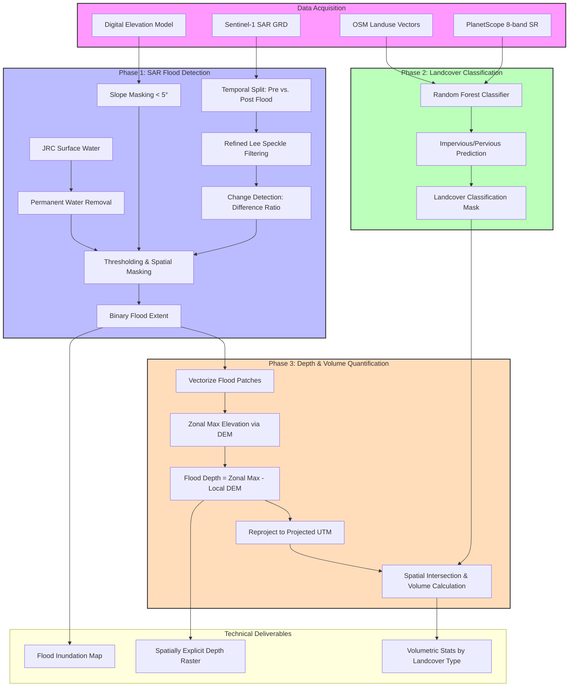

## A scalable workflow for urban flood quantification: Fusing Sentinel-1 SAR, PlanetScope imagery, and elevation models
 
This repository contains a comprehensive geospatial pipeline for analyzing urban flooding in Bengaluru, India. The project integrates multi-source satellite data (Sentinel-1 SAR, PlanetScope) and elevation models to detect flooded areas, classify urban landcover, and estimate flood depth and volume.

## 📁 Project Structure

*   **`01_sar_flood_detection.py`**: Google Earth Engine (GEE) script for SAR-based flood mapping using a change-detection approach.
*   **`02_landcover_classification.py`**: Machine Learning pipeline to distinguish between impervious and pervious surfaces.
*   **`03_depth_and_volume_calc.py`**: Integrated analysis to calculate flood depth and water volume across different urban landcover types.

---

## 🗺️ Workflow Diagram

---

## 🚀 Key Features

### 1. Advanced SAR Flood Detection
Utilizes **Sentinel-1 Ground Range Detected (GRD)** imagery in the VH polarization to identify water-induced backscatter changes.
*   **Refined Lee Filter:** Implements a custom 7x7 speckle reduction algorithm to maintain edge integrity while reducing radar noise.
*   **Change Detection:** Comparison of "before" and "after" flood event mosaics (November 2021).
*   **Terrain Correction:** Integrates HydroSHEDS DEM to mask out steep slopes (>5°) where flooding is physically improbable.
*   **Noise Reduction:** Connected component analysis to remove isolated "salt-and-pepper" pixels.

### 2. Urban Landcover Classification
Employs **Random Forest Classification** to map the urban fabric.
*   **Input Data:** High-resolution PlanetScope 8-band imagery.
*   **Optimized Rasterization:** Fast extraction of training data from large vector datasets (OSM-derived) using chunk-based processing.
*   **Classes:** Categorizes the city into **Impervious** (roads, buildings, concrete) and **Pervious** (parks, open soil, vegetation).
*   **Accuracy Assessment:** Includes built-in validation with confusion matrices and classification reports.

### 3. Depth and Volume Quantification
A final integration step to assess the physical magnitude of the flood event.
*   **Flood Depth Mapping:** Calculated as the difference between the Digital Elevation Model (DEM) and the estimated water surface elevation (Zonal Max).
*   **Volume Estimation:** Converts pixel-level depth into total volumetric displacement (m³).
*   **Landcover Intersection:** Quantifies flood impact specifically on impervious vs. pervious surfaces, providing insights into urban runoff and drainage challenges.

---

## 🛠 Technical Stack

*   **Platform:** Google Earth Engine (Python API)
*   **Core Libraries:** `ee`, `rasterio`, `geopandas`, `numpy`, `scikit-learn`, `shapely`
*   **Data Sources:**
    *   **SAR:** Copernicus Sentinel-1
    *   **Optical:** PlanetScope Analytic (8-band)
    *   **DEM:** CartoDEM / High Resolution DEM
    *   **Vectors:** OpenStreetMap (OSM)

---

## 📖 Usage Workflow

1.  **Detection:** Run `01_sar_flood_detection.py` to generate the `Flooded_Area_Bengaluru` TIFF.
2.  **Classification:** Execute `02_landcover_classification.py` using local high-res imagery to generate the impervious/pervious mask.
3.  **Quantification:** Use `03_depth_and_volume_calc.py` to ingest the flood mask, landcover mask, and DEM to generate depth rasters and final volume statistics.

---

## 📊 Results & Outputs
*   **Flood Extent (Ha):** Total area inundated.
*   **Flood Depth (m):** Spatially explicit depth map.
*   **Volumetric Impact (m³):** Water volume sitting on impervious vs. pervious surfaces.

---
📘 *This work is part of the book chapter:*  
**"A Scalable Workflow for Urban Flood Quantification: Fusing Sentinel-1 SAR, PlanetScope Imagery, and Elevation Models"**  
👤 *Author: Raghavendra S P & Prakash P S*

